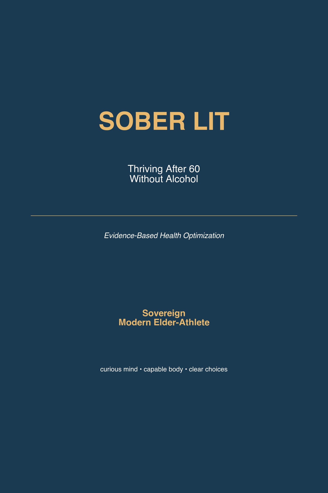

# Sober Lit - Distribution Files

**Generated:** November 24, 2024
**Version:** Working Draft

---

## Available Formats

### 📱 **EPUB (Recommended for Apple Books)**
**`SoberLit_Draft_20241124.epub`** (354 KB)
- Perfect for Apple Books on iPhone, iPad, Mac
- **Includes professional cover image**
- Reflowable text (adjusts to screen size)
- Built-in table of contents
- Night mode compatible

**To use on Apple devices:**
1. Double-click the .epub file on Mac (opens in Books app)
2. Or AirDrop to iPhone/iPad
3. Or email to yourself and open on device

---

### 📄 **PDF**
**`SoberLit_Draft_20241124.pdf`** (598 KB)
- **Professional cover page included**
- Professional formatting
- Fixed layout (looks the same on all devices)
- Table of contents with clickable links
- Good for printing or annotating

---

### 🌐 **HTML (Single Page)**
**`SoberLit_Draft_20241124.html`** (365 KB)
- Read in any web browser
- Styled with clean, readable CSS
- Searchable with browser find (Cmd+F)
- Can work offline

---

### 🎨 **Cover Image**
**`cover.png`** (122 KB)
- Professional minimalist design
- Deep blue-gray with gold accents
- Features the identity mantra: "curious mind • capable body • clear choices"
- Embedded in EPUB and PDF versions

---

## What's Included

All formats contain the same complete draft:

**Front Matter:**
- Foreword
- Introduction

**Part I: The Situation** (~2,600 words)

**Part II: The Evidence** (~25,000 words)
- Cardiovascular Health
- Dementia & Cognitive Decline
- Falls & Balance
- Cancer Risk
- Mental Health (with dopamine neuroscience)
- Sleep Disruption
- Inflammation
- Liver, Gut & Weight
- Metabolism & Weight
- Sexual Function
- Medication Interactions
- Myths vs. Reality
- Common Misconceptions

**Part III: The Philosophy** (~24,500 words)
- Chapter 1: The Mortality Paradox
- Chapter 2: Emotional Operating System
- Chapter 3: We Are All Athletes
- Chapter 4: Chosen Adversity
- Chapter 5: Connection and Community
- Chapter 6: The Modern Elder
- Chapter 7: Behavior Architecture

**Part V: The Execution**
- 30/60/90 Day Implementation Guide

**Total:** ~44,000 words, 3-4 hours reading time

---

## Not Yet Included

**Part IV: The Tactics** - Currently outlined but not yet fully drafted. These chapters will be added in the next version.

---

## Format Recommendations

**Best for reading on the go:** EPUB (Apple Books)
**Best for annotation:** PDF
**Best for quick reference:** HTML (searchable in browser)

---

## Technical Details

All formats generated from the same source markdown using Pandoc with metadata:

- Title: "Sober Lit: Thriving After 60 Without Alcohol"
- Subtitle: "Evidence-Based Health Optimization for the Modern Elder-Athlete"
- Language: English (US)
- TOC depth: 2 levels
- Chapter splitting: Level 2 headings

---

**Enjoy your reading!**

*See `READ_ME_FIRST.md` in parent directory for detailed content guide.*
